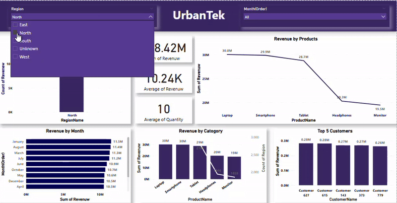

# UrbanTek Sales Analysis Dashboard

This dashboard provides a comprehensive overview of UrbanTek's sales performance, broken down by region, month, product, category, and top customers. It allows for a detailed understanding of revenue generation and customer behavior.

  

## Key Performance Highlights

* **Total Revenue:** ₹510.37 Million
* **Average Revenue:** ₹10.21 Thousand
* **Average Quantity:** 10

These high-level metrics provide a snapshot of the overall sales performance of UrbanTek.

## Regional Performance

### Revenue by Region

* **Visualization Type:** Bar Chart
* **Metric:** Sum of Revenue
* **Regions:** North, East, West, South
* **Insights:** Revenue is relatively consistent across all four regions, with North showing slightly higher revenue compared to the others.

    | Region | Sum of Revenue (₹ Million) |
    | :----- | :------------------------- |
    | North  | 12.5K                      |
    | East   | 12.4K                      |
    | West   | 12.3K                      |
    | South  | 12.2K                      |

## Product Performance

### Revenue by Products

* **Visualization Type:** Line Chart
* **Metric:** Sum of Revenue
* **Products:** Smartphone, Laptop, Tablet, Headphones, Monitor
* **Insights:** Smartphones generate the highest revenue, followed by Laptops and Tablets. Headphones and Monitors contribute significantly less to the total revenue. There's a clear downward trend in revenue as we move from Smartphones to Monitors.

    | Product     | Sum of Revenue (₹ Million) |
    | :---------- | :------------------------- |
    | Smartphone  | 122M                       |
    | Laptop      | 117M                       |
    | Tablet      | 112M                       |
    | Headphones  | 90M                        |
    | Monitor     | 79M                        |

### Revenue by Category

* **Visualization Type:** Stacked Bar Chart
* **Metric:** Sum of Revenue
* **Categories:** Smartphone, Laptop, Tablet, Headphones, Monitor
* **Insights:** This chart visually reinforces the revenue contribution of each product category, aligning with the "Revenue by Products" trend. Smartphones represent the largest segment, followed by Laptops and Tablets.

## Monthly Performance

### Revenue by Month

* **Visualization Type:** Horizontal Bar Chart
* **Metric:** Sum of Revenue
* **Months:** August to June (in descending order)
* **Insights:** Revenue appears relatively stable across the months shown, ranging from ₹42 Million to ₹45 Million. August shows the highest revenue in this period.

    | Month     | Sum of Revenue (₹ Million) |
    | :-------- | :------------------------- |
    | August    | 45M                        |
    | January   | 45M                        |
    | March     | 44M                        |
    | July      | 44M                        |
    | October   | 43M                        |
    | September | 43M                        |
    | May       | 43M                        |
    | April     | 43M                        |
    | June      | 42M                        |

## Customer Performance

### Top 5 Customers

* **Visualization Type:** Bar Chart
* **Metric:** Sum of Revenue
* **Customers:** Customer 263, Customer 791, Customer 194, Customer 655, Customer 389
* **Insights:** The top 5 customers contribute a significant portion of the revenue, with Customer 263 generating the highest revenue among them. The revenue generated by these top customers is quite close, suggesting a relatively even distribution among the top tier.

    | Customer ID | Sum of Revenue (₹ Million) |
    | :---------- | :------------------------- |
    | 263         | 1.0M                       |
    | 791         | 0.87M                      |
    | 194         | 0.86M                      |
    | 655         | 0.81M                      |
    | 389         | 0.80M                      |

## Potential Insights

* **Product Focus:** Smartphones are the primary revenue driver for UrbanTek.
* **Consistent Regional Performance:** Sales are well-distributed across different regions.
* **Stable Monthly Revenue:** Revenue generation is relatively consistent throughout the observed months.
* **Key Customers:** A small number of top customers contribute significantly to the overall revenue.

## Potential Areas for Further Analysis

* **Profitability by Product:** Analyze the profit margins for each product to understand which products are most profitable.
* **Customer Segmentation:** Further segment customers to identify different buying patterns and behaviors.
* **Regional Growth:** Investigate growth trends in each region over a longer period.
* **Impact of Promotions:** Analyze the impact of any marketing campaigns or promotions on sales figures.
* **Customer Acquisition Cost:** Understand the cost associated with acquiring new customers and compare it to the revenue generated.
* **Product Returns and Refunds:** Analyze the rate of returns and refunds for different product categories.
* **Market Basket Analysis:** Understand which products are frequently purchased together.
